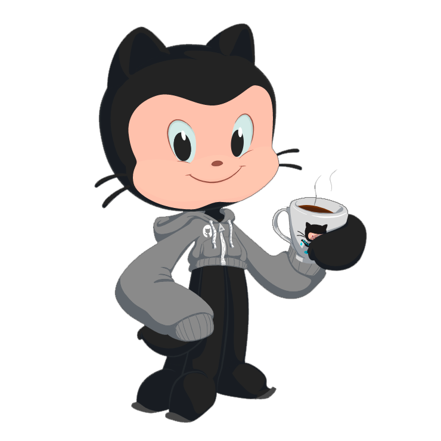
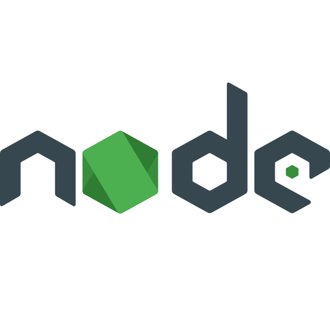
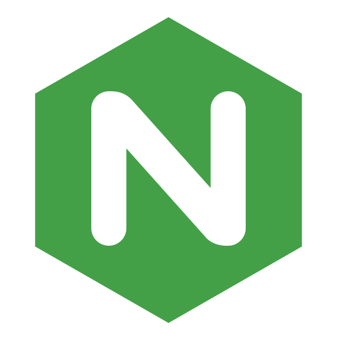
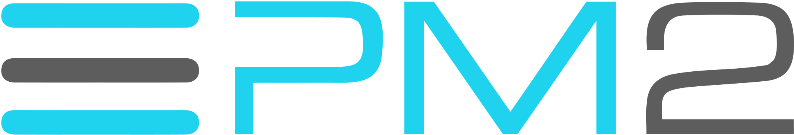

  <h1>Hello there! I'm Octavio Lage</h1>

I'm a Brazilian Software Engineering student passionate about learning and, maybe one day in the future, I'll teach too.  
I'm very interested in the DevOps area, always looking for process improvements.  
I am also looking to develop my leadership and team management skills. 

<b>I can collaborate with:</b>

<table border="0">
  <tr>
    <td align="center"><b>Programming languages</b></td>
    <td align="center"><b>Frameworks/Libraries</b></td>
    <td align="center"><b>Other tools</b></td>
    <td align="center"><b>Cloud</b></td>
  </tr>
  <tr>
    <td align="center">

C language</td>
    <td align="center">

React</td>
    <td align="center">

Node.js</td>
    <td align="center">

Amazon Web Services</td>
  </tr>
  <tr>
    <td align="center">

Python 3</td>
    <td align="center">

</td>
    <td align="center">

Nginx</td>
    <td align="center">

Google Cloud Platform</td>
  </tr>
  <tr>
    <td align="center">

Java</td>
    <td align="center">

</td>
    <td align="center">

PM2</td>
    <td align="center">

Heroku</td>
  </tr>
  <tr>
    <td align="center">

JavaScript</td>
    <td align="center">

</td>
    <td align="center">

PostgreSQL</td>
    <td align="center">

</td>
  </tr>
  <tr>
    <td align="center">

TypeScript</td>
    <td align="center">

</td>
    <td align="center">

</td>
    <td align="center">

</td>
  </tr>
  
</table>

